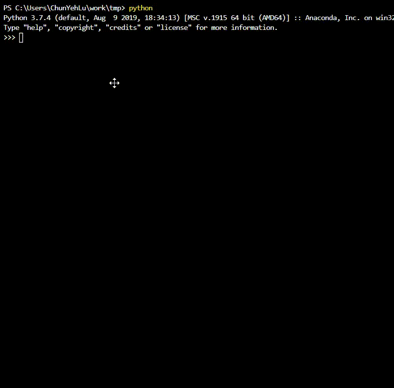
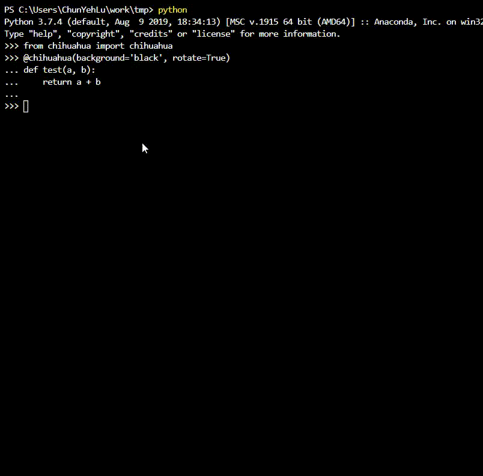
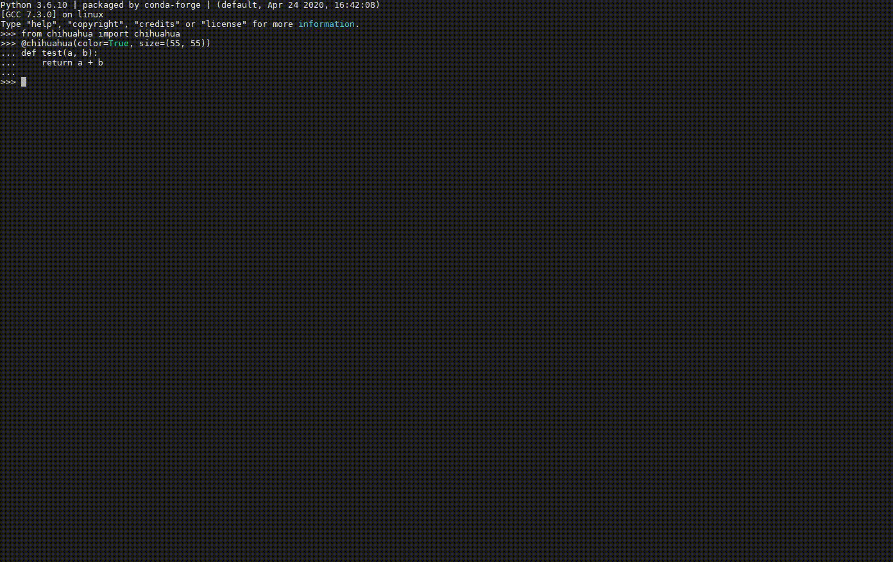

# chihuahua
一個 python 的 decorator，可以幫助使用者感受到吉娃娃的關懷
  
   
範例1：  
```python
>>> from chihuahua import chihuahua
>>> @chihuahua(background='black')
>>> def test(a, b):
>>>     return a + b
>>> 
>>> test(1, 2)
```

  
範例2：  
```python
>>> from chihuahua import chihuahua
>>> @chihuahua(background='black', rotate=True)
>>> def test(a, b):
>>>     return a + b
>>> 
>>> test(1, 2)
```
  
  
範例3：  
```python
>>> from chihuahua import chihuahua
>>> @chihuahua(color=True, size=(55, 55))
>>> def test(a, b):
>>>     return a + b
>>> 
>>> test(1, 2)
```
  
